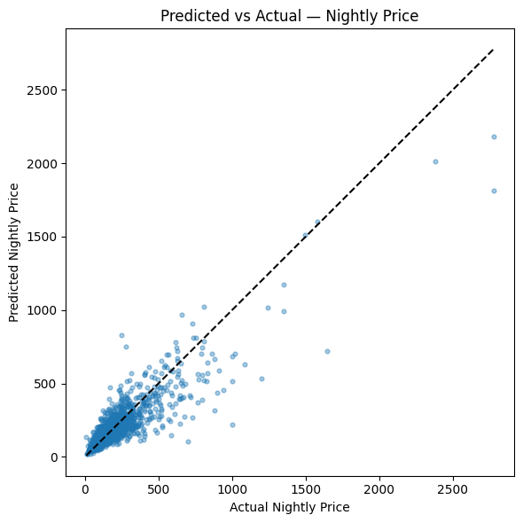
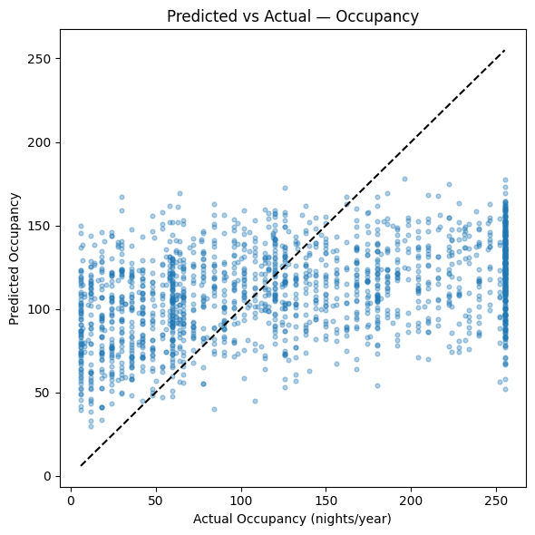
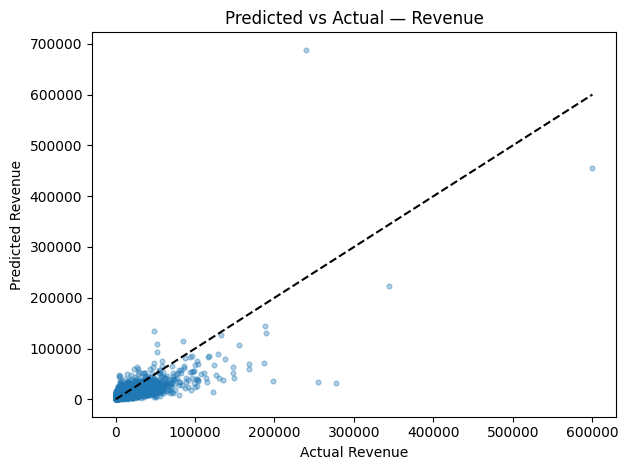

# Short-Term Rental Revenue Estimator  
#### Predicting nightly price, annual occupancy, and total STR revenue for unrented properties

## Overview

This project predicts potential **annual Short-Term Rental (STR) revenue** for properties that are *not currently listed* on Airbnb. Using open data sources (Inside Airbnb, U.S. Census ACS, OpenStreetMap), a geo-aware cold-start embedding system, and a multi-model LightGBM pipeline, the system estimates:

- Nightly price  
- Annual occupancy  
- Annual revenue  

New listings lack reviews, host history, and booking performance — features that strongly influence STR outcomes. To overcome this cold-start problem, the model builds a geospatial performance embedding that aggregates nearby and structurally similar listings across multiple distance bands. This produces a surrogate performance profile even when no historical data exists for a property.

A FastAPI web application allows users to input a Zillow URL and minimal property attributes to receive a revenue estimate and an AI-generated investment rating (“good / ok / caution / avoid”).

Additionally, a scenario explorer mode evaluates how changes to features (amenities, capacity, personal-use assumptions) affect revenue using SHAP-derived marginal effects. This turns the system from a passive predictor into an interactive decision-support tool.

---

## Predictive Modeling

Three interconnected **LightGBM** models power the system:

1. **Nightly Price Model**  
2. **Annual Occupancy Model**  
3. **Annual Revenue Model**, constrained such that: 
Revenue ≈ Price × Occupancy

The revenue model learns a correction on top of price × occupancy to capture nonlinearities and city-specific dynamics.

---

## Model Performance

### **Nightly Price**
- **MAE:** 52.14  
- **RMSE:** 93.37  
- **R²:** 0.772  

---

### **Occupancy**
- **MAE:** 67.26 nights  
- **RMSE:** 80.30 nights  
- **R²:** 0.111  

Occupancy is substantially more difficult to predict due to host behavior, listing visibility, cancellations, and dynamic pricing. This level of variance is typical for STR datasets.

---

### **Revenue**
- **MAE:** $12,605  
- **RMSE:** $23,235  
- **R²:** 0.410  

Despite upstream noise, revenue predictions maintain a clear diagonal structure.

### **Revenue Percent Error Distribution**  
A scale-neutral view of model bias and variance.

---

## Data Sources

| Source | Description |
|--------|-------------|
| **InsideAirbnb** | Prices, availability, reviews, host metadata |
| **OpenStreetMap** | Points of interest, transit nodes, walkability indicators |
| **U.S. Census / ACS** | Demographics, income, housing stock, density |
| **Zillow** | Runtime property metadata extraction |

---

## Methodology

### **Feature Engineering**
- Haversine distances  
- POI density + categorical encoding  
- Census block-group joins  
- Amenity extraction  
- Log scaling for skewed variables  
- Pandera schema validation + type coercion  

---

### **Geospatial Performance Embeddings (Cold-Start Engine)**  
For each property, the model:

1. Computes distances to all nearby listings  
2. Aggregates structural & performance features across multiple distance bands  
3. Applies inverse-distance weighting  
4. Concatenates band-level summaries  
5. Reduces dimensionality using PCA  

This yields a 32-dimensional vector representation capturing local pricing and occupancy patterns — crucial for properties with no historical data.

---

### **LightGBM Modeling Pipeline**
Each model performs:

- K-fold cross-validation  
- Hyperparameter tuning  
- Out-of-fold predictions for unbiased revenue correction  
- SHAP interpretability  
---

## Web Application

### **Inputs**
- Zillow URL  
- Bedrooms  
- Bathrooms  
- Personal-use assumptions  

### **Outputs**
- Predicted nightly price  
- Predicted annual occupancy  
- Annual revenue estimate  
- Investment rating (Good / OK / Caution / Avoid)  
- Natural-language rationale  
- Optional SHAP-based scenario explorer  

---

## Planned Improvements
- Batch-accelerated embeddings (Numba or FAISS inference)  
- Seasonality models for city-specific demand cycles  
- Enhanced occupancy modeling using listing-age & booking-lead signals  
- More robust Zillow scraping
