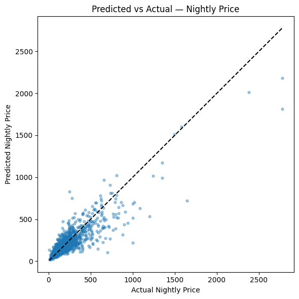
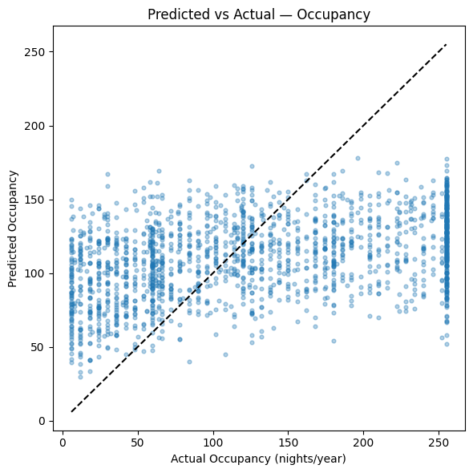
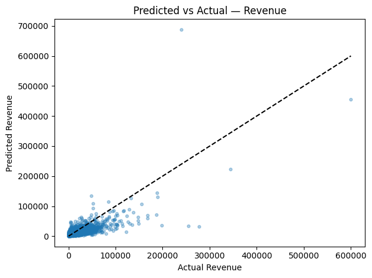
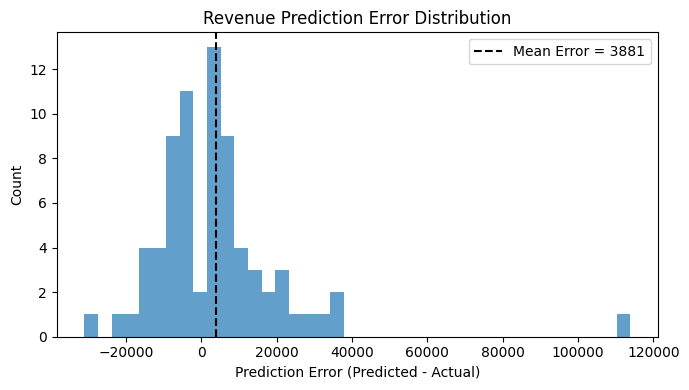

# Short-Term Rental Revenue Estimator

Predicting nightly price, annual occupancy, and total STR revenue for unrented properties using geospatial machine learning.

## Overview

This project predicts potential **annual Short-Term Rental (STR) revenue** for properties that are *not currently listed* on Airbnb. Using open data sources (Inside Airbnb, U.S. Census ACS, OpenStreetMap), a geo-aware cold-start embedding system, and a multi-model LightGBM pipeline, the system estimates:

- Nightly price  
- Annual occupancy  
- Annual revenue  

New listings lack reviews, host history, and booking performance — features that strongly influence STR outcomes. To overcome this cold-start problem, the model builds a geospatial performance embedding that aggregates nearby and structurally similar listings across multiple distance bands. This produces a surrogate performance profile even when no historical data exists for a property.

A FastAPI web application allows users to input a Zillow URL and minimal property attributes to receive a revenue estimate and an AI-generated investment rating ("good / ok / caution / avoid").

Additionally, a scenario explorer mode evaluates how changes to features (amenities, capacity, personal-use assumptions) affect revenue using SHAP-derived marginal effects. This turns the system from a passive predictor into an interactive decision-support tool.

---

## Quick Start

### Prerequisites

- Python 3.12+
- OpenAI API key (for AI analysis feature)

### Installation

```bash
# Clone the repository
git clone <repository-url>
cd team_53_str

# Create virtual environment and install dependencies
make venv
make install

# Or manually:
python3.12 -m venv venv
source venv/bin/activate
pip install -r requirements.txt
```

### Running the Application

```bash
# Start the development server
make run

# Or manually:
uvicorn app.main:app --reload --port 8000
```

The application will be available at `http://localhost:8000`.

### Running Tests

```bash
make test

# Or manually:
pytest tests/
```

---

## Project Structure

```
team_53_str/
├── app/                          # Main application code
│   ├── main.py                   # FastAPI entry point with lifespan management
│   ├── api/
│   │   ├── api.py                # Main API routes (/preds, /perms, /preds_w_AI)
│   │   └── debug.py              # Debug endpoints
│   ├── core/
│   │   ├── config.py             # Configuration (data paths, city centers, embedding params)
│   │   ├── store.py              # DataStore class with geocoding cache
│   │   ├── loader.py             # Loads models, OSM features, creates DataStore
│   │   └── col_control.py        # Feature lists (PERF_FEATS, STRUCTURAL_FEATS)
│   ├── model/
│   │   ├── base_model.py         # LightGBMRegressorCV (sklearn-compatible CV wrapper)
│   │   ├── embedder.py           # PerformanceGraphEmbedderV3 (FAISS-based embeddings)
│   │   ├── assembler.py          # Pops class (orchestrates full pipeline)
│   │   └── rev_modeler.py        # RevenueModeler (revenue correction)
│   ├── schemas/
│   │   ├── pydantic_.py          # Pydantic schemas (AddressData, QueryInput)
│   │   └── pandera_.py           # Pandera schemas for DataFrame validation
│   └── utils/
│       ├── input_builder.py      # build_base() - builds features from address
│       ├── perm_builder.py       # Scenario permutation logic
│       └── ai_analyzer.py        # PropertyInvestmentAnalyzer (OpenAI integration)
├── models/pops_/                 # Pre-trained model artifacts
│   ├── pops.joblib               # Full pipeline (price, occupancy, revenue models)
│   ├── embedder.joblib           # Trained PerformanceGraphEmbedderV3
│   └── embeddings.parquet        # Pre-computed training embeddings
├── data/                         # Data sources
│   ├── df_clean_city_subset_*.csv  # Training data
│   ├── census_data.parquet       # Census demographics
│   └── osm/                      # OpenStreetMap POI features
├── templates/                    # Jinja2 HTML templates
├── notebooks/                    # Development notebooks (01-05)
├── tests/                        # Test suite
├── Dockerfile                    # Container image definition
├── Makefile                      # Development commands
└── cloudbuild.yaml               # GCP Cloud Build deployment
```

---

## Technology Stack

| Category | Technologies |
|----------|--------------|
| **Backend** | FastAPI, Uvicorn, Pydantic |
| **ML/Data** | LightGBM, scikit-learn, SHAP, Pandas, NumPy |
| **Geospatial** | GeoPandas, Shapely, FAISS-cpu |
| **Validation** | Pandera (DataFrames), Pydantic (API) |
| **AI** | OpenAI API |
| **Geocoding** | Geopy (Nominatim/OSM) |
| **Deployment** | Docker, GCP Cloud Run, Cloud Build |

---

## API Endpoints

| Endpoint | Method | Description |
|----------|--------|-------------|
| `/` | GET | Main prediction UI |
| `/ai` | GET | AI analysis page |
| `/api/preds` | POST | Returns JSON predictions only |
| `/api/perms` | POST | Generates scenario permutations with SHAP explanations |
| `/api/preds_w_AI` | POST | Full pipeline with AI investment summary |
| `/api/from_url` | POST | Redirects to output page |

### Example Request

```bash
curl -X POST "http://localhost:8000/api/preds" \
  -H "Content-Type: application/json" \
  -d '{
    "url": "https://www.zillow.com/homedetails/...",
    "beds": 3,
    "baths": 2,
    "accommodates": 6
  }'
```

---

## Predictive Modeling

Three interconnected **LightGBM** models power the system:

1. **Nightly Price Model**  
2. **Annual Occupancy Model**  
3. **Annual Revenue Model**, constrained such that:<br>
Revenue ≈ Price × Occupancy

The revenue model learns a correction on top of price × occupancy to capture nonlinearities and city-specific dynamics.

---

## Model Performance

### **Nightly Price**
- **MAE:** 52.14  
- **RMSE:** 93.37  
- **R²:** 0.772  



---

### **Occupancy**
- **MAE:** 67.26 nights  
- **RMSE:** 80.30 nights  
- **R²:** 0.111  

Occupancy is substantially more difficult to predict due to host behavior, listing visibility, cancellations, and dynamic pricing. This level of variance is typical for STR datasets.



---

### **Revenue**
- **MAE:** $12,605  
- **RMSE:** $23,235  
- **R²:** 0.410  

Despite upstream noise, revenue predictions maintain a clear diagonal structure.



### **Revenue Percent Error Distribution**  
A scale-neutral view of model bias and variance.



---

## Data Sources

| Source | Description |
|--------|-------------|
| **InsideAirbnb** | Prices, availability, reviews, host metadata |
| **OpenStreetMap** | Points of interest, transit nodes, walkability indicators |
| **U.S. Census / ACS** | Demographics, income, housing stock, density |
| **Zillow** | Runtime property metadata extraction |

---

## Methodology

### **Feature Engineering**
- Haversine distances  
- POI density + categorical encoding  
- Census block-group joins  
- Amenity extraction  
- Log scaling for skewed variables  
- Pandera schema validation + type coercion  

---

### **Geospatial Performance Embeddings (Cold-Start Engine)**  
For each property, the model:

1. Computes distances to all nearby listings  
2. Aggregates structural & performance features across multiple distance bands  
3. Applies inverse-distance weighting  
4. Concatenates band-level summaries  
5. Reduces dimensionality using PCA  

This yields a 32-dimensional vector representation capturing local pricing and occupancy patterns — crucial for properties with no historical data.

---

### **LightGBM Modeling Pipeline**
Each model performs:

- K-fold cross-validation  
- Hyperparameter tuning  
- Out-of-fold predictions for unbiased revenue correction  
- SHAP interpretability  
---

## Web Application

### **Inputs**
- Zillow URL  
- Bedrooms  
- Bathrooms  
- Personal-use assumptions  

### **Outputs**
- Predicted nightly price  
- Predicted annual occupancy  
- Annual revenue estimate  
- Investment rating (Good / OK / Caution / Avoid)  
- Natural-language rationale  
- Optional SHAP-based scenario explorer  

---

## Deployment

### Docker

```bash
# Build the image
docker build -t str-estimator .

# Run locally
docker run -p 8080:8080 -e OPENAI_KEY=your-key str-estimator
```

### GCP Cloud Run

The project includes `cloudbuild.yaml` for automated deployment:

1. Fetches data and models from GCS
2. Builds Docker image
3. Deploys to Cloud Run with 4Gi memory

Triggered automatically on git push or manually via:

```bash
gcloud builds submit --config=cloudbuild.yaml
```

### Environment Variables

| Variable | Description | Required |
|----------|-------------|----------|
| `OPENAI_KEY` | OpenAI API key for AI analysis | For AI features |
| `K_SERVICE` | Auto-set by Cloud Run | Auto |
| `TESTING` | Set to skip model loading in tests | For testing |

---

## Supported Cities

The model currently supports properties in these metro areas:

- Austin, TX
- Boston, MA
- Chicago, IL
- And others in `CITY_SUBSET` (see `app/core/config.py`)

---

## Planned Improvements

- Batch-accelerated embeddings (Numba or FAISS inference)
- Seasonality models for city-specific demand cycles
- Enhanced occupancy modeling using listing-age & booking-lead signals
- More robust Zillow scraping

---

## License

See LICENSE file for details.
